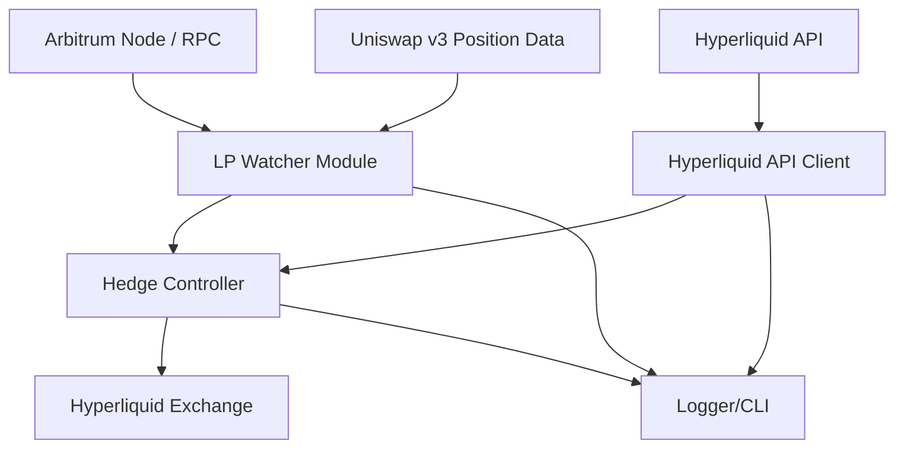

# HOYT Bot - Delta Neutral Hedging/Farming Bot

## Overview

HOYT is a delta-neutral farming and hedging bot designed for DeFi on Ethereum L2 networks (starting with Arbitrum). The first version operates with the **PENDLE/USDT** pool on Uniswap v3 and hedges exposure by shorting **PENDLE-PERP** on Hyperliquid.

### Key Features

- Monitors Uniswap v3 LP positions in real-time
- Automatically hedges exposure on Hyperliquid via its API
- Rebalances when position drift exceeds configurable thresholds
- Monitors funding rates to optimize hedge positions
- Gas-efficient operations (only rebalances when necessary)
- Modular codebase designed for easy adaptation to other token pairs
- Robust error handling with automatic recovery
- Comprehensive logging system
- Docker support for easy deployment
- Unit testing with Vitest

## Architecture



## Requirements

- Node.js 16+
- TypeScript 4.5+
- Arbitrum RPC endpoint
- Wallet with LP position in PENDLE/USDT Uniswap v3 pool
- Hyperliquid account with API key

## Installation

### Standard Installation

1. Clone the repository:
   ```
   git clone https://github.com/yourusername/hoyt-bot.git
   cd hoyt-bot
   ```

2. Install dependencies:
   ```
   npm install
   ```

3. Create a `.env` file based on `.env.example`:
   ```
   cp .env.example .env
   ```

4. Configure your `.env` file with your wallet, API keys, and trading parameters.

5. Build and start the bot:
   ```
   npm run build
   npm start
   ```

### Docker Installation

1. Clone the repository and configure `.env` as above.

2. Build and start with Docker Compose:
   ```
   docker-compose up -d
   ```

3. Check logs:
   ```
   docker-compose logs -f
   ```

## Configuration

The `.env` file contains all necessary configuration:

| Variable | Description |
|:---|:---|
| PENDLE_USDT_UniswapV3Pool | Target LP pool address |
| HOYT_WALLET | Your wallet address for LP position monitoring |
| HOYT_WALLET_PK | Private key (for potential future transaction signing) |
| ARBITRUM_RPC | RPC URL to connect to Arbitrum |
| PAIR_TICKER | Pair traded (initially PENDLE/USDT) |
| TRASHOLD_REBALANCE | Threshold to rebalance hedge (e.g., 5 for 5%) |
| TRASHOLD_FUNDING | Max acceptable funding cost (e.g., 0.5 for 0.5%) |
| TRASHOLD_SLIPPAGE | Max allowed slippage on hedging orders |
| HYPERLIQUID_PK | Signing key for Hyperliquid API |
| HYPERLIQUID_API | Hyperliquid API endpoint |
| INVESTMENT_IN_POOL | LP investment amount (for reference) |
| HYPERLIQUID_INVESTMENT | Margin allocated for shorting on Hyperliquid |
| CHECK_INTERVAL_MS | Frequency of position checks (in milliseconds) |

## Development

### Project Structure

```
hoyt-bot/
├── src/
│   ├── main.ts                 # Entry point
│   ├── config.ts               # Configuration
│   ├── types.ts                # Type definitions
│   ├── logger.ts               # Logging utility
│   ├── modules/
│   │   ├── lpWatcher.ts        # LP position monitoring
│   │   ├── hedgeController.ts  # Hedge position management
│   │   └── hyperliquidClient.ts # Hyperliquid API client
│   └── utils/
│       ├── calculations.ts     # Math utility functions
│       ├── configValidator.ts  # Config validation
│       ├── errorHandler.ts     # Error handling
│       └── secureUtils.ts      # Security utilities
├── tests/                      # Unit tests
├── scripts/                    # Utility scripts
├── .env.example                # Environment variable template
└── docker-compose.yml          # Docker setup
```

### Available Scripts

- `npm start` - Start the bot
- `npm run build` - Build TypeScript code
- `npm test` - Run unit tests
- `npm run lint` - Run ESLint
- `npm run format` - Format code with Prettier
- `./scripts/build.sh` - Build and validate the project

## Strategy Logic

1. **Position Monitoring**: 
   - Bot continuously monitors LP position in Uniswap v3
   - Calculates the token exposure that needs to be hedged

2. **Hedging Logic**:
   - Initiates a short position on Hyperliquid for the exposed amount
   - Monitors for position drift as prices change

3. **Rebalancing Trigger**:
   - Rebalances when drift exceeds configured threshold (default 5%)
   - Considers funding rates before making hedge adjustments

4. **Optimization**:
   - Only rebalances when necessary to save on fees
   - Avoids unfavorable funding rate environments
   - Auto-recovery from temporary errors

5. **Error Handling**:
   - Robust error recovery with retry mechanisms
   - Comprehensive logging for diagnostics
   - Automated restart capability for critical failures

## Example Calculation

**Investment**:
- $100 provided as LP on PENDLE/USDT
- Initially split ~50/50:
  - $50 in PENDLE
  - $50 in USDT
- Short $50 worth of PENDLE on Hyperliquid
- Need only ~$10-20 margin due to leverage

**Rebalance Triggered If**:
- LP PENDLE value drifts by more than 5% compared to short position
- For example, if LP PENDLE value grows to $55, bot increases short position

## Adapting for Other Tokens

To use this bot with a different token pair:

1. Update the `.env` file with new pool address and token ticker
2. Make sure the corresponding perpetual is available on Hyperliquid
3. Adjust thresholds based on the volatility of the new token

## Security Considerations

Please review the [SECURITY.md](SECURITY.md) file for important security considerations and best practices when using this bot.

## Contributing

Contributions are welcome! Please follow these steps:

1. Fork the repository
2. Create a feature branch
3. Make your changes with tests
4. Submit a pull request

## License

MIT

---

Created for delta-neutral yield farming strategies on Arbitrum L2.