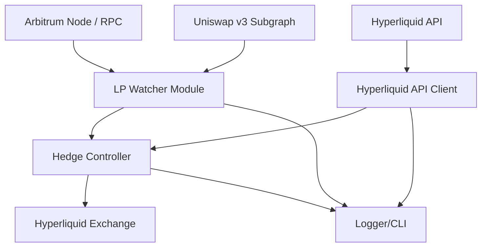
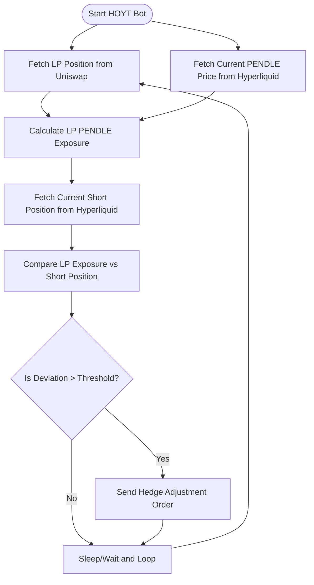

# HOYT Bot - Delta Neutral Hedging/Farming Bot

## Description

**HOYT** is a delta-neutral farming and hedging bot designed for DeFi on Ethereum L2 (starting with Arbitrum).
Its first version operates with the **PENDLE/USDT** pool on Uniswap v3 and hedges exposure by shorting **PENDLE-PERP** on Hyperliquid.

**Key Features:**
- Monitor Uniswap v3 LP positions.
- Hedge exposure automatically on Hyperliquid using signed API transactions.
- Rebalance hedges when thresholds are crossed.
- Low slippage, gas-efficient, rebalance only when necessary.
- Designed for fast adaptation to any similar pool (replace PENDLE/USDT easily).

**Initial Investment Example:**
- LP side: $100 in PENDLE/USDT.
- Hedge side: $20 margin on Hyperliquid to short $50 worth of PENDLE.
- Rebalance threshold: 5% deviation.
- Funding tolerance: 0.5% daily.
- Max slippage tolerance: 0.5%.

---

## Project Architecture

---

## Function Flow

---

## Example Calculation

**Investment:**
- $100 provided as LP on PENDLE/USDT
- $50 equivalent of PENDLE exposure to be hedged

**Steps:**
1. LP split 50/50:
   - $50 in PENDLE
   - $50 in USDT
2. Short $50 worth of PENDLE on Hyperliquid.
3. Hyperliquid Margin:
   - Only ~$5–10 margin needed due to 5x–10x leverage.
4. Rebalance triggered if:
   - LP PENDLE value drifts by more than 5% compared to short position.

**Thresholds Configured:**
- Rebalance Threshold: 5%
- Funding Cost Tolerance: 0.5% per day
- Slippage Tolerance for hedge adjustment orders: 0.5%

---

## Environment Variables from environment.txt

| Variable | Description |
|:---|:---|
| PENDLE_USDT_UniswapV3Pool | Target LP pool address |
| HOYT_WALLET | Your wallet address |
| HOYT_WALLET_PK | Private key for Uniswap interactions |
| ARBITRUM_RPC | RPC URL to connect to Arbitrum |
| PAIR_TICKER | Pair traded (initially PENDLE/USDT) |
| TRASHOLD_REBALANCE | Threshold to rebalance hedge |
| TRASHOLD_FUNDING | Max acceptable funding cost |
| TRASHOLD_SLIPPAGE | Max allowed slippage on hedging orders |
| HYPERLIQUID_PK | Signing key for Hyperliquid |
| HYPERLIQUID_API | Hyperliquid API endpoint/key |
| INVESTMENT_IN_POOL | LP investment amount |
| HYPERLIQUID_INVESTMENT | Margin allocated for shorting |

---

**Note:**  
- Other pools besides PENDLE/USDT can be supported by changing `PAIR_TICKER` and corresponding pool address.
- Architecture is built to be **modular** and **easy to switch tokens**.

---

# END
